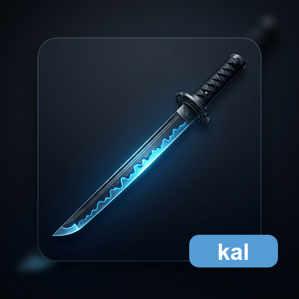

  

<h1 align="center">katana-ast-lint</h1>

  A library-only Rust AST lint crate for shared KatanA ecosystem governance.

  <strong><a href="#installation">Installation</a></strong> |
  <strong><a href="#library-api">Library API</a></strong> |
  <strong><a href="#downstream-integration">Downstream Integration</a></strong> |
  <strong><a href="docs/quality-gates.md">Quality Gates</a></strong> |
  <strong><a href="docs/release-runbook.md">Release</a></strong>

  
  
  
  
  
  

---

## What is katana-ast-lint

`katana-ast-lint` provides reusable Rust syntax-tree checks for KatanA ecosystem
repositories. It was extracted from the KatanA workspace so separated crates can
share the same structural rules, violation shape, and release-grade quality
gate.

The crate is intentionally library-only. It does not provide a CLI, binary
target, editor extension, or user-facing command. Consumer repositories call the
Rust API from their own tests, repository adapters, and CI jobs.

KAL is the shared rule boundary for the KatanA series, not a replacement for
Rust linting foundations such as Clippy, Dylint, ast-grep, or Semgrep. Future
configuration work can delegate parsing or rule execution to mature external
libraries when that makes the shared rules more robust.

## Features

- **Shared Rust AST rules** migrated from the KatanA workspace.
- **Structured violations** with file, line, column, and message fields.
- **Adapter-friendly API** so repository-specific paths and fixtures stay out of
  common rules.
- **Repository quality gates** for KME, preview, editor, export, widget, and
  KatanA integration work.
- **Library-only boundary** with no `[[bin]]` target and no CLI contract.
- **KML-style release flow** with signed tags, GitHub Releases, crates.io
  publication, and release preflight checks.

## Installation

Add the crate to the repository-specific lint crate or test harness:

~~~bash
cargo add katana-ast-lint --dev
~~~

Use a path dependency while developing sibling repositories locally:

~~~toml
[dev-dependencies]
katana-ast-lint = { path = "../katana-ast-lint" }
~~~

## Library API

Parse a Rust source file and run an individual rule:

~~~rust
use katana_ast_lint::rules::LazyCodeOps;
use katana_ast_lint::utils::LinterParserOps;
use std::path::Path;

let path = Path::new("src/lib.rs");
let syntax = LinterParserOps::parse_file(path)?;
let violations = LazyCodeOps::lint(path, &syntax);
~~~

Run a repository gate from an integration test:

~~~rust
use katana_ast_lint::AstLinterOps;
use katana_ast_lint::rules::{FileLengthOps, FunctionLengthOps};
use std::path::PathBuf;

let source_roots = vec![PathBuf::from(env!("CARGO_MANIFEST_DIR")).join("src")];

AstLinterOps::run_with_configured_rule(
    "file-length",
    "Split files that exceed the responsibility boundary.",
    &source_roots,
    FileLengthOps::lint_with_config,
);

AstLinterOps::run_with_configured_rule(
    "function-length",
    "Extract helper methods when functions grow too large.",
    &source_roots,
    FunctionLengthOps::lint_with_config,
);
~~~

## Downstream Integration

Consumer repositories should expose their own `just ast-lint` target and call
`katana_ast_lint` from tests or a repository-local adapter. This keeps each
repository's source roots, fixtures, and scoped allowances local while preserving
the shared rule implementation.

Recommended shape:

~~~text
crates/<repo>-linter/
  Cargo.toml
  tests/ast_linter.rs
just/quality.just
~~~

The common rules must not hard-code KME, preview, editor, export, widget, or
KatanA paths. Repository differences belong in the consumer adapter. The planned
v0.2.0 configuration contract will formalize those repository differences in
`kal.json`.

## Quality Gates

Run the local gate before committing:

~~~bash
just check
~~~

`just check` runs formatting, Clippy, repository AST lint, unit tests, and
OpenSpec validation. Use focused targets when iterating:

~~~bash
just fmt-check
just lint
just ast-lint
just test
just openspec-check
~~~

Dependency maintenance follows the same Justfile entrypoint shape as KatanA and
KML:

~~~bash
just update-safe
just update
~~~

`just update-safe` respects the current `Cargo.toml` SemVer ranges. `just update`
uses `cargo upgrade -i` and then refreshes `Cargo.lock`.

## Release Policy

`Cargo.toml` is the version source of truth. Release branches should use the
same `release/vX.Y.Z` shape as sibling KatanA ecosystem repositories when a
release PR is needed.

- Run `just VERSION=vX.Y.Z release-check` before publication.
- Merge `release/vX.Y.Z` into `master` to create the signed tag, GitHub Release,
  and crates.io publication automatically.
- Run `just VERSION=vX.Y.Z release-github` to create or update only the GitHub
  Release manually.
- Run `just VERSION=vX.Y.Z release` when crates.io publication is intended.
- GitHub Releases require a signed annotated `vX.Y.Z` tag that GitHub reports as
  Verified.
- `just release` stops before dispatch when the requested version already exists
  on crates.io.
- crates.io publication requires the `CARGO_REGISTRY_TOKEN` GitHub secret.

See [`docs/release-runbook.md`](docs/release-runbook.md) for the full release
sequence and [`docs/quality-gates.md`](docs/quality-gates.md) for required gates.

## Non-Goals

- Replacing `rustc`, rustfmt, or Clippy.
- Providing a CLI or user-facing command.
- Embedding KME, preview, editor, export, widget, or KatanA application types.
- Using broad exclusions as the default fix for rule failures.

## License

MIT - see [LICENSE](LICENSE).
